# WB's Glances

A self-hosted homelab dashboard built on [Glance](https://github.com/glanceapp/glance): fourteen tabs, a small companion service that
adds the things Glance does not do (editable bookmarks, notes, a to-do list, add/remove video channels and news feeds, cross-tab search,
cached summaries), PIN-locked "private" widgets, and read-only host agents. Everything is plain YAML, a few Python scripts and
three small front-end files, and **this repo is both the showcase and the backup**: clone it, fill in a `.env`, run one script.

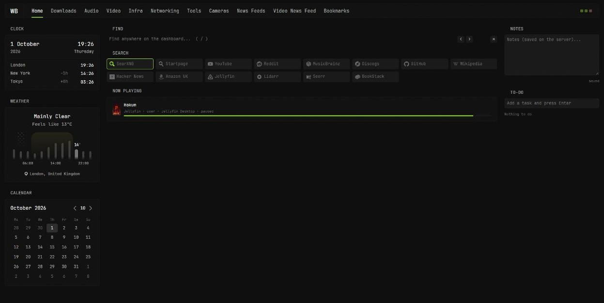

> The screenshots are taken from the live dashboard with the wallpaper removed, camera images blurred, download names blurred and a
> few personal strings swapped out. The real thing has album art, posters and live camera tiles.

---

## What you get

| | |
|---|---|
| **14 tabs** | Home, Downloads, Audio, Video, Infra, Networking, Remote, Tools, Dev, Shopping, Cameras, News Feeds, Video News Feed, Bookmarks |
| **Find** | one search box that finds anything on *any* tab, jumps to it and highlights the match (`/` focuses it) |
| **Per-engine search bars** | SearXNG, Startpage, YouTube, Reddit, MusicBrainz, GitHub, and more: one click each |
| **Notes and to-do** | saved on the server, so they follow you between devices |
| **Live infra** | Proxmox nodes, containers, PBS backups, every physical disk with SMART health, a map of what is mounted where |
| **Locked widgets** | PIN-gated rows that show only "Private" (no name, no link, no images) until unlocked |
| **Editors on the page** | add/remove bookmarks, YouTube channels, RSS feeds and subreddits without touching a file |
| **Cameras** | live view, detections by type, 24-hour activity, search by date and time (Frigate) |
| **Carousels with arrows** | every sideways strip has left/right buttons on desktop, swipe on touch |
| **Least privilege** | Glance's container only receives the variables its config uses; every host agent is read-only and token-protected |

---

## Tour

### Downloads
SABnzbd, Seerr requests, Radarr / Sonarr / Lidarr (queue, missing, 30-day upcoming), Soulseek and Prowlarr. Two further rows sit behind the lock.

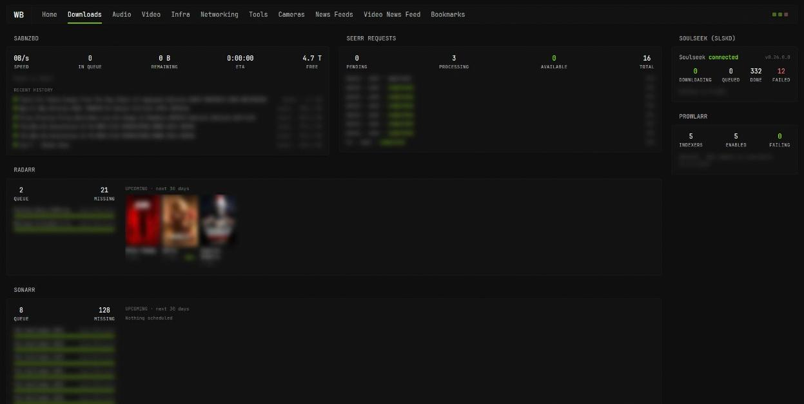

### Audio
Netflix-style shelves from Navidrome (recently added, recently played, most played, a random "discover" row), and Audiobookshelf with
*Continue listening* plus **one random row per library**. A private library has its own locked row.

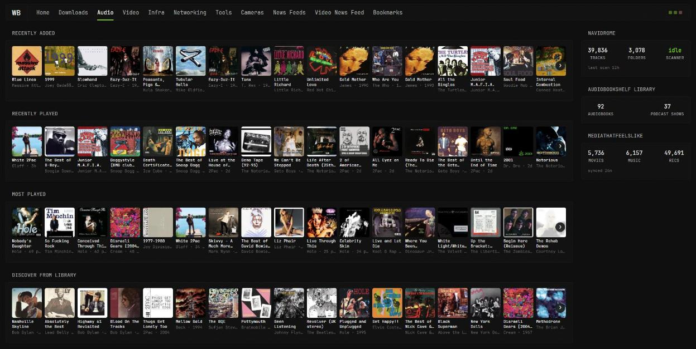

### Video
Jellyfin: continue watching, recently added, and a "movies that feel like" row. Two locked widgets (shown as "Private") hold the private media apps.

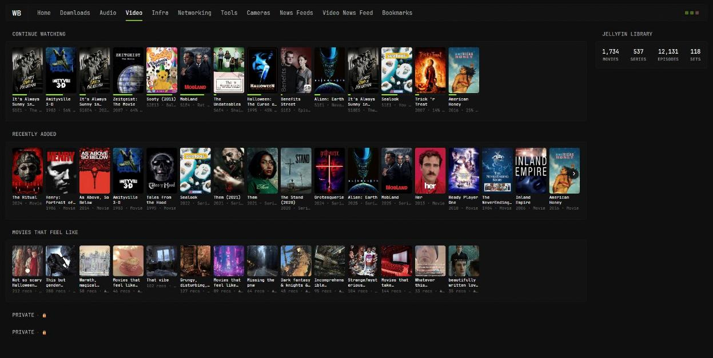

### Infra
Proxmox nodes with their containers (CPU, RAM, disk), the Backup Server, Dockge-style stack lists for each Docker host, and a "failed tasks" counter
that ignores Proxmox's harmless console-session noise. Names of private containers are only listed inside a locked widget.

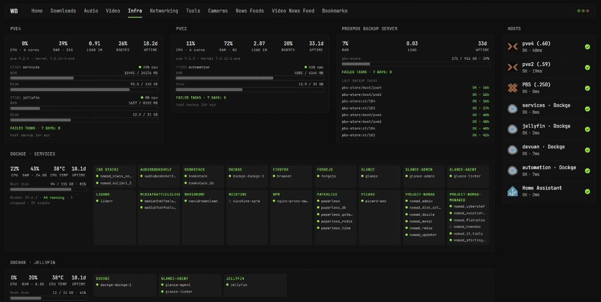

The **infrastructure map** shows every drive and mount, and the **storage and backups** widget lists *every physical disk on every host* (model, size,
SMART health, SSD life left, and what it is used for), live space in use, and which guests have a recent backup:

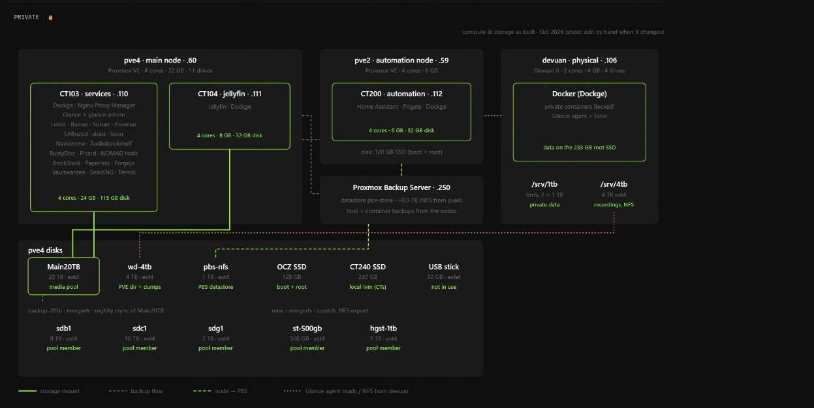
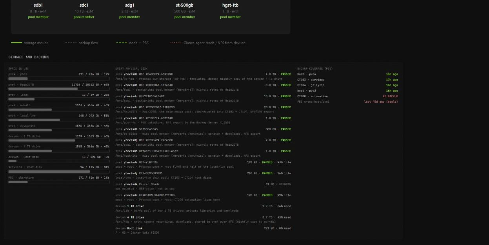

### Networking
A diagram of the network, Pi-hole stats (with the "top blocked domains" collapse), Tailscale devices (OAuth, read-only), and Nginx Proxy Manager with a
check of every backend. Problems always show; **all proxy hosts** are in a collapsed list.

**VPN control** sits under the Tailscale row: one card per machine running the [WBs-VPN-Dashboard](https://github.com/WB2024/WBs-VPN-Dashboard) agent, with a country picker, Connect / Disconnect, kill-switch and Tailscale toggles and a DNS mode (keep local names or the Pi-holes working while connected). A connect that would leave the machine without DNS or internet is rolled back automatically.

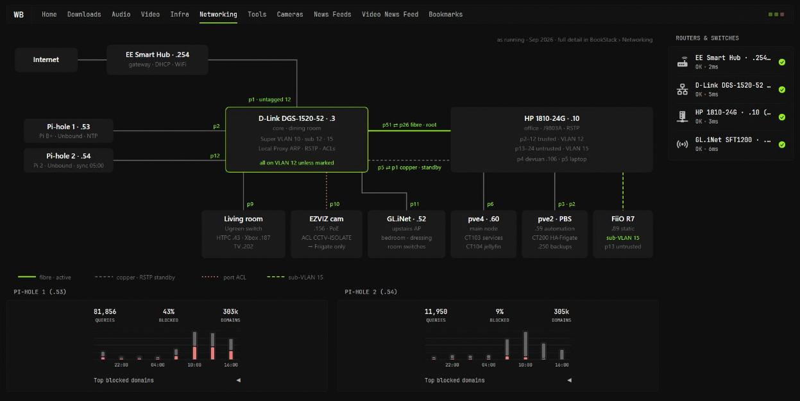

### Tools
RustyDisc (CD ripping), Paperless-ngx and BookStack, and a **rich card for each small tool**, built from the tool's own API plus its container's uptime, CPU and RAM:
**Kiwix** (offline libraries by subject, biggest libraries, every library linked), **SearXNG** (a search box, engines on per category, plugins, safe-search),
**NOMAD** (service list with update notices, host CPU/RAM/storage/swap), **Kolibri** (users, learners, channels), **Stirling PDF** (tools enabled, uptime, update notice),
**Flatnotes** (note counts only, never titles), **Homebox** (installed vs latest version), and the remote apps and password vault. A "latest releases" column is built from GitHub's
public Atom feeds (no API token, no rate limit). The developer tools (CyberChef, IT Tools, Excalidraw, Dozzle, Termix) live on the Dev tab.

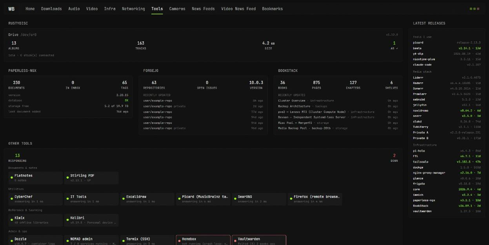

### Dev
GitHub and the local Forgejo in one place: profile and stats, a **contribution graph**, a language mix, activity (repeated automated pushes are folded into one row),
repository cards with the last commit and CI result, open pull requests and issues, CI runs, and the **dev tools** (CyberChef, IT Tools, Excalidraw, Dozzle, Termix)
with one-click recipes. Dev search covers GitHub code/repos, MDN, Stack Overflow, Docker Hub, PyPI, npm, crates.io and more. **Private repositories and the activity in them
appear only inside a PIN-locked widget** (and are never written to disk by glance-admin). Needs `GITHUB_TOKEN` for the graph, CI, last commits and private repos; without it
you get public data only.

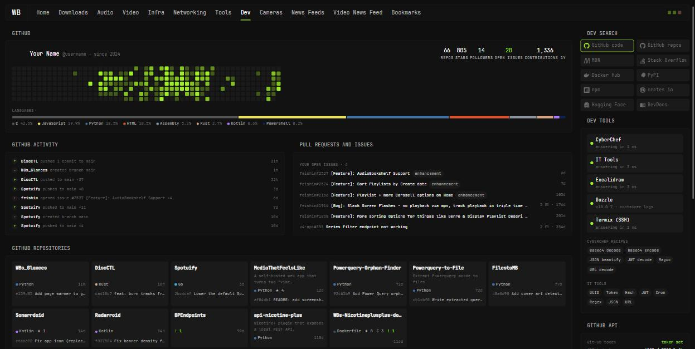

### Shopping
A shopping tab for tech, music, home, DIY and tools. **One search box across 20 UK shops** (eBay, Amazon, CeX, Scan, CCL, Screwfix, Toolstation, B&Q, Discogs, Vinted and more); a **shopping list**
and a **wishlist** with target prices that live on the server (so every device sees the same lists); **gift ideas in a PIN-locked widget**; **deals** from HotUKDeals and r/UKDeals with **alert words** you
choose (matching deals float to the top); **saved eBay searches** through eBay's official API; **price and stock watches** powered by a changedetection.io container (a wishlist item gets a one-click
"Watch price" and shows when it falls to your target); **Raspberry Pi stock** for the UK; your **Discogs** collection value, recent additions and wantlist prices; and a **purchases and spend** log
with a six-month chart by category. Shops that block automated requests (Currys and Scan answer 403 to scripts) are shown as blocked rather than failing silently.

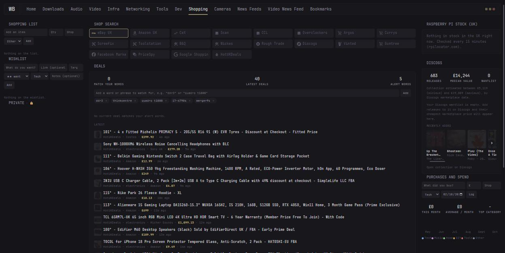

### Cameras
Live view from Frigate (a still image, upgraded to a stream only while the tile is on screen and the tab is visible), recent detections, and **search**:
type what you are looking for ("red jacket", "goth", "carrying a parcel") and Frigate's **semantic search** returns the best matches, either by the written
**description** Gemini adds for people near the camera, or by **appearance** (the picture itself, for everything else), narrowed by type, camera and a date/time range.
Click any thumbnail for a viewer with the snapshot, the clip, the description and previous/next. The images below are blurred for privacy.

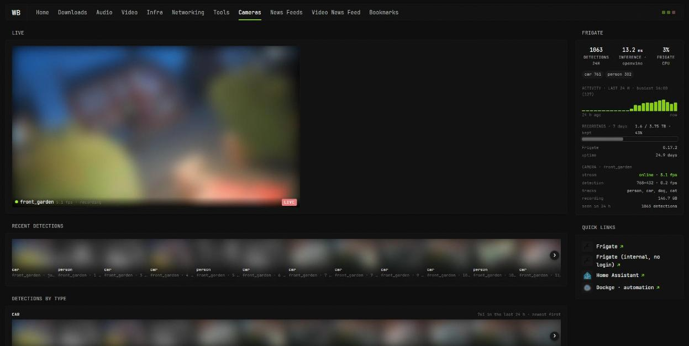

### News Feeds
Hacker News and Lobsters, tech news, music press, homelab blogs, markets, and 31 subreddits in tabbed groups. The **Feeds** box at the top adds an
RSS feed (it checks that the address really is a feed) or a subreddit to any group, and removes them again.

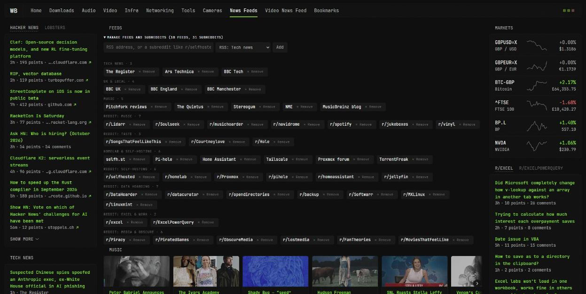

### Video News Feed
One carousel per YouTube channel, newest first, with arrows to scroll. Add a channel by `@handle`, link or id (it is verified against the channel's own feed);
each channel has a Remove button.

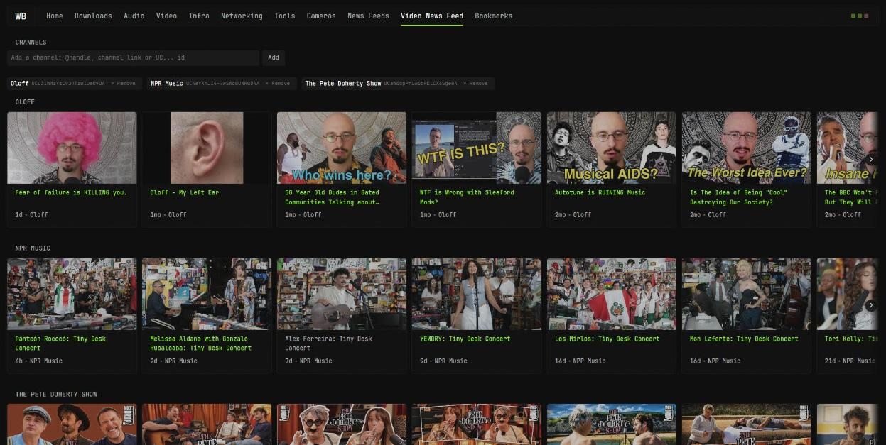

### Bookmarks
Grouped bookmarks with cached favicons (no third-party icon lookups), an **Edit bookmarks** panel for add / move / remove, and optional **private groups** that
live in a locked widget. This repo ships a small starter set; your own list lives in `opt/glance/data/bookmarks.json`.

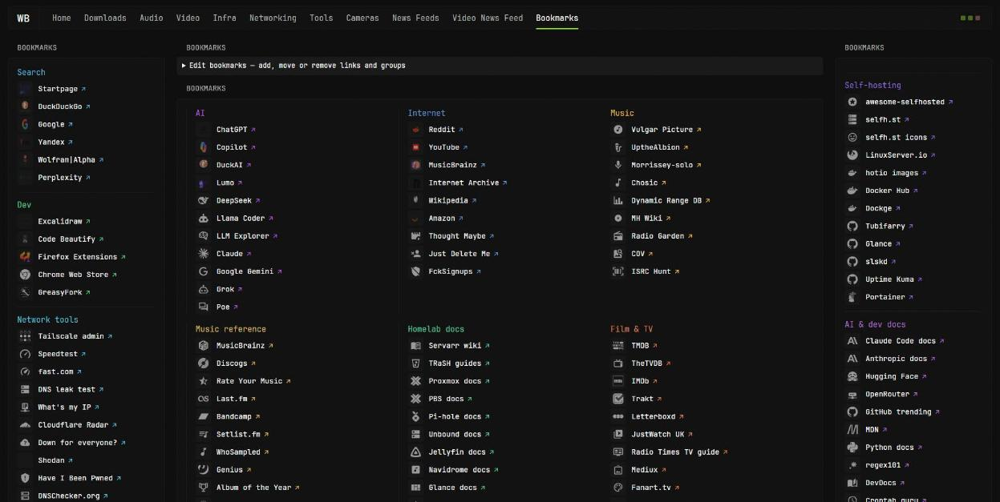

---

## How it fits together

```
 browser ──▶ Glance :3002 ──────────────▶ your services (Jellyfin, *arr, Navidrome, Pi-hole, Frigate, ...)
    │            │  custom-api widgets
    │            └────────────────────────▶ glance-admin :3005 ──▶ Proxmox, PBS, Tailscale, NPM, Frigate, GitHub, Audiobookshelf,
    │                                          (holds the secrets      Paperless, Forgejo, BookStack, Immich, ...
    │                                           Glance must not have)
    └── wb-home.js / wb-restricted.js ───▶ glance-admin  (notes, to-do, find, editors)

 other hosts: glance-agent :27973 (CPU / RAM / disks) + glance-lister :27974 (container names, read-only)
```

* **Glance** (`glanceapp/glance`, pinned) renders the pages from `opt/glance/config`. It hot-reloads when a file changes.
* **glance-admin** (`opt/glance-admin`, stdlib-only Python, 128 MB) is the companion: it caches slow or secret-bearing summaries (so Glance never needs those keys),
  proxies cover art, stores notes/to-do, builds the cross-tab Find index, and **writes the Bookmarks, News Feeds and Video News pages** from JSON state when you use the editors.
* **Front end** is three files in `opt/glance/assets/glance`: `custom.css`, `wb-home.js` (search, Find, editors, carousel arrows, live camera streams), `wb-restricted.js` (the lock).
* **Host agents**: Glance's official `agent` for CPU/RAM/disks plus a tiny read-only `glance-lister` (`opt/glance/tools/host-stack/lister`) that returns container names, state and CPU temperature, nothing else (never environment variables).

### Config model

```
opt/glance/config/glance.yml          theme, presets, the three front-end scripts, the page list
opt/glance/config/pages/*.yml         8 pages written by tools/gen_*.py (re-runnable; or edit the YAML by hand)
opt/glance/config/data/*.yml          3 pages written by glance-admin (Bookmarks, News Feeds, Video News Feed): do not hand-edit
opt/glance/data/*.json                state: bookmarks, channels, news feeds, notes, to-do
```

`${VAR}` in any YAML is replaced from the container environment, and **Glance refuses to start if a variable is undefined**: after adding one, run
`python3 tools/sync_env.py` (it checks, and writes `glance.env`) and recreate the container.

---

## Locked widgets

Give any widget `css-class: wb-restricted` and it is collapsed behind a PIN. While locked it shows only **Private**: no title, no link, no images are fetched.
Entering the PIN once unlocks every locked widget in that browser tab (`sessionStorage`), including private bookmark groups in the Edit panel.

The page ships only a random salt and `SHA-256(salt + PIN)` (`scripts/make_pin_config.py` writes `wb-restricted-config.js`). **This is casual privacy, not security**:
the widget data is still in the page source for anyone who looks, and a short PIN can be brute-forced offline. It keeps a visitor or a passing glance out; do not
rely on it for anything that matters. Real protection means putting the dashboard behind your reverse proxy's authentication.

The two private apps in this copy of the config are called **Private A** and **Private B** (env prefixes `PRIVA_` and `PRIVB_`), and the Immich widget sits beside them.
Point them at whatever apps you like.

---

## Install / restore

Needs a Linux host with Docker (compose plugin) and Python 3. The paths are fixed at `/opt/...`.

```bash
git clone git@github.com:WB2024/WBs_Glances.git
cd WBs_Glances
sudo scripts/install.sh        # 1st run: copies the files, creates /opt/glance/.env from the example, stops
sudo nano /opt/glance/.env     # fill in the host addresses, API keys and GLANCE_PIN
sudo scripts/install.sh        # 2nd run: PIN config, env split, builds glance-admin, starts both containers
```

Then open `http://<host>:3002`. The script is safe to re-run: it never overwrites an existing `.env` or your data files (bookmarks, notes, feeds).

**Restoring the live system** is the same two commands: the repo holds everything except secrets, so a rebuilt machine only needs the `.env` back.
The `.env` is the one thing this repo cannot hold; keep a copy in your password manager.

What to put in `.env` (see `opt/glance/.env.example` for every name):

| Group | Variables |
|---|---|
| Hosts (not secret) | `HOST_SVC`, `HOST_JELLY`, `HOST_AUTO`, `HOST_DEVUAN`, `HOST_PVE4`, `HOST_PVE2`, `HOST_PBS`, `HOST_PIHOLE1/2`, `HOST_ROUTER`, `HOST_CORE`, `HOST_OFFICE_SW`, `HOST_AP` |
| Service keys | one key per service the pages use (Jellyfin, Navidrome, SABnzbd, Radarr, Sonarr, Lidarr, Prowlarr, Seerr, slskd, Pi-hole, Audiobookshelf, Immich, the two private apps) |
| Infra | `PROXMOX_USER` / `PROXMOX_PASSWORD` (an API **token** with the `PVEAuditor` role), `PBS_PASSWORD`, `TAILSCALE_OAUTH_ID/SECRET` (read-only), `NPM_USER` / `NPM_PASS` (a view-only user) |
| Tools | `BOOKSTACK_TOKEN`, `PAPERLESS_TOKEN`, `FORGEJO_TOKEN` |
| Shopping | `DISCOGS_TOKEN` (Discogs > Settings > Developers), `EBAY_APP_ID` + `EBAY_CERT_ID` (free keys from developer.ebay.com, production keyset; without them the eBay section just explains what is missing), `CHANGEDETECTION_URL` / `CHANGEDETECTION_KEY` (the key is filled in by `install.sh`) |
| Dev | `GITHUB_USER`, `GITHUB_TOKEN`: create a **fine-grained** personal access token (GitHub > Settings > Developer settings), repository access *All repositories*, permissions **read-only**: Metadata, Contents, Issues, Pull requests, Actions. Nothing here ever writes to GitHub. |
| Lock | `GLANCE_PIN` |
| Agents | `AGENT_TOKEN_SVC`, `AGENT_TOKEN_JELLY`, `AGENT_TOKEN_DEVUAN` (any long random strings; the same value goes on the matching host) |

Optional: `scripts/proxmox-host/install-glance-disks.sh` (run on a Proxmox host, with `TOKEN` set to `AGENT_TOKEN_PVE4`) adds per-mount space usage to the Infra disk list. It serves only device, mount point, filesystem and sizes.

Use read-only keys wherever the service lets you, and give the Proxmox token no more than `PVEAuditor`.

### Other hosts (agent + lister)

For every machine you want on the Infra page, run the host stack there (it needs Docker):

```bash
# on the remote host
mkdir -p /opt/stacks/glance-agent && cp -r opt/glance/tools/host-stack/* /opt/stacks/glance-agent/
cat > /opt/stacks/glance-agent/.env <<'EOF'
AGENT_TOKEN=<the AGENT_TOKEN_* value for this host>
HOST_LABEL=devuan
AGENT_MOUNTPOINTS="/host-root:Root disk,/host-root/srv/data:Data drive,!/host-root/var/lib/docker"
EOF
cd /opt/stacks/glance-agent && docker compose up -d --build
```

`AGENT_MOUNTPOINTS` is `path:Display name`, comma separated, with `!path` to hide one; paths are under `/host-root` because the agent sees the host's `/` there.
The Glance host itself only needs the lister (`opt/stacks/glance-agent`).

---

## Regenerating pages

The eight hand-built pages come from `opt/glance/tools/gen_<page>.py`: each writes a page file, so you can change the Python and re-run it, or edit the YAML directly.
The safe routine is: generate to a temp file, validate the YAML and the `${VAR}` references, then move it into place (Glance reloads by itself).

```bash
python3 tools/gen_infra.py /tmp/infra.yml && python3 -c "import yaml;yaml.safe_load(open('/tmp/infra.yml'))" && mv /tmp/infra.yml config/pages/infra.yml
python3 check_pages.py        # fetches every tab, reports widget errors
```

After a CSS-only change, restart the container (the stylesheet URL is versioned at start-up) or hard-refresh. `gen_tools.py` reads an old Media page from `legacy/` for
the RustyDisc card; the generated `tools.yml` is included, so you only need it if you want to regenerate that page.

What lives where inside glance-admin (`opt/glance-admin`): `app.py` (HTTP server, routes, caches), `infra.py` (Proxmox/PBS/agents, the `ROLES` table that describes each disk),
`net.py` (Tailscale, NPM), `tools.py`, `releases.py`, `cameras.py` (Frigate), `channels.py`, `news.py`, `bookmarks.py`.

---

## Keeping this repo as a backup

`scripts/export.sh` pulls the running config from the live host over SSH, **sanitises** it (`scripts/sanitize.py`) and leaves the changes in the working tree for you to
review, commit and push. The sanitiser copies an allow-list of files only, swaps personal data for neutral examples, and **fails the run** if any value from the real
`.env` files, any e-mail address or any long token is still in the output.

```bash
scripts/export.sh
git diff
git add -A && git commit -m "Update config" && git push
```

What is deliberately *not* here: every `.env` and token; the PIN hash and salt (`make_pin_config.py` makes a new one); notes and to-do; caches; cover art; wallpaper and
third-party icon packs (`/assets/images`; bookmarks without a local icon fall back to a generic one); backups; and the names of the two private apps (replaced by
placeholders from a local, git-ignored table). The bookmark list in this repo is a starter set, not the live one.

---

## Housekeeping on the Glance host

* Docker leftovers: `docker image prune -f` after every rebuild of a locally built image (each build leaves ~0.8 GB of untagged layers), and
  `docker image ls` / `docker system df` to spot tags nothing uses.
* Application backups can quietly dominate a small disk. Lidarr's database was 3.6 GB and four manual copies of it were 12 GB: check `du -xh --max-depth=2 /opt | sort -hr | head`.
* `journalctl --vacuum-size=200M` keeps the journal small; `/var/lib/containerd` holds the image layers when Docker uses the containerd snapshotter.

---

## Known limits

* Glance's `custom-api` timeout is 5 s and a failing widget shows an error until its cache expires, so slow or flaky sources go through glance-admin's cached summaries.
* Glance has no per-widget authentication: use a reverse proxy login if the dashboard is reachable by anyone you do not trust.
* Reddit often answers 403/429 to servers: Glance's own reddit widgets keep working, but the Feeds box can only warn when it cannot confirm a subreddit exists.
* The static diagrams (the Infra map, the Networking topology) are SVG written by hand in `gen_infra.py` / `gen_networking.py`: edit them when the hardware changes. The disk list beside them is live.

## Credits

[Glance](https://github.com/glanceapp/glance) by glanceapp, [Dashboard Icons](https://github.com/homarr-labs/dashboard-icons) and [Simple Icons](https://simpleicons.org) through Glance's `di:` / `si:` prefixes,
[Material Design Icons](https://pictogrammers.com/library/mdi/) through `mdi:`. Everything in `opt/` is the configuration and glue written for this setup.

See [`docs/REFERENCE.md`](docs/REFERENCE.md) for the long-form reference: every page, every endpoint, the runbook and the security notes.
